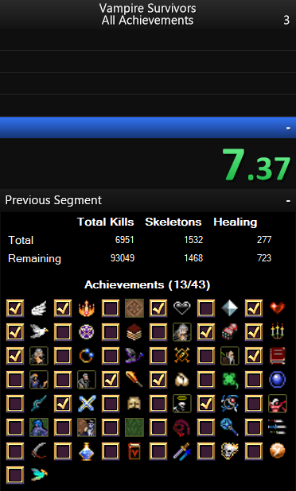

LiveSplit.VampireSurvivors
==========================

A LiveSplit component for tracking kills, healing, and achievements for Vampire Survivors (All Achievements) speedruns.

This component works by reading the save data of your Vampire Survivors game, allowing it to automatically keep track of cumulative kills, healing, and all achievements in the current save file.

## Features

- Automatically updates based on save data content &mdash; no need to manually mark achievements off
- Tracks cumulative total kills, skeleton kills, and healing
- Tracks achievements attained so far, displaying them in the in-game order using the in-game icons
- Achievement descriptions on icon hover
- Automatically detects the game version and shows on the achievements attainable in the detected game version

### Limitations

Achievements and kills/healing are only updated at the end of each run. This is because this component works by parsing the save data and so it has to wait for the game to write new data, which only happens at the end of a run.

### Supported versions

Vampire Survivors versions 0.2.11 and up are supported.

Older versions will probably still work, but they will display all 43 achievements attainable in 0.2.11 regardless of their existence in the installed version of Vampire Survivors. Any issues encountered when using this component with a version of Vampire Survivors older than 0.2.11 will not be addressed, as the component does not provide support for those versions.

## Instructions

### Installation
1. Install the [LiveSplit desktop app](https://livesplit.org/downloads/)
2. Download the latest release of this component from the [Releases page](https://github.com/TalkTakesTime/LiveSplit.VampireSurvivors/releases)
3. Unzip the `dll`s from the release and copy them into the `Components` folder in your LiveSplit installation directory

### Usage
1. Run LiveSplit
2. Open the layout editor
3. Add the Vampire Survivors component: `+ > Information > Vampire Survivors Tracker`
4. Open Layout Settings and go to the Vampire Survivors Tracker tab
5. Ensure that the Vampire Survivors installation directory has been filled in the text box. If it is not automatically detected, use the `...` button to manually select it
6. Accept the layout and return to the main LiveSplit screen

You may need to readjust your LiveSplit window's size to ensure that the achievements tracker is fully visible. It should look like this (with the exact achievements shown varying depending on your Vampire Survivors version):

__Note:__ It will start tracking stats when you start a split, and it will stop tracking when you stop a split. When LiveSplit's timer is not running (unless paused), it will display the default all-zero stats.

### Upgrading

- Follow steps 2 and 3 of the Installation instructions, copying the new `dll`s over the old ones.
- Ensure that the Vampire Survivors installation directory is correct, as in step 5 of the Usage instructions.

### Building
1. Clone the [LiveSplit repository](https://github.com/LiveSplit/LiveSplit)
2. Set up a working build environment for LiveSplit according to their instructions and ensure that you can build it
3. Clone this repository in the same parent directory as LiveSplit, such that the directories for both repositories share the same parent
4. Open this solution in Visual Studio or JetBrains Rider and build it

## Troubleshooting

If you encounter any issues while using this component, please open a GitHub issue with a detailed description of the problem.

## License

This repository is licensed under the [ISC license](LICENSE).
